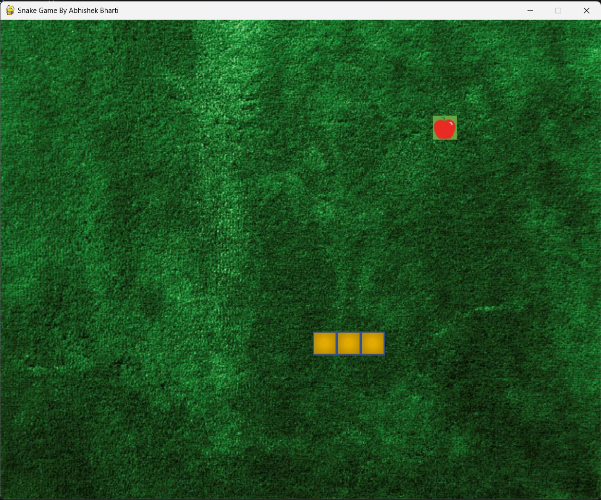

# Python Snake Game with Pygame

This is a classic Snake game developed using Python and the Pygame library.



## Features

- Play the classic Snake game with intuitive controls.
- Collect apples to increase your score and the length of the snake.
- Avoid colliding with the walls and your snake's tail.
- Endless gameplay with increasing difficulty.
- Background music and sound effects for an immersive gaming experience.

## Installation

1. Ensure you have Python installed. You can download it from [python.org](https://www.python.org/downloads/).

2. Clone this repository to your local machine using the following command:

   ```shell
   git clone https://github.com/your-username/snake-game.git

cd snake-game
pip install pygame
python main.py

To make this README effective, you should include the following:

1. Screenshots of the game in action to showcase its appearance.
2. Licensing details if you have chosen a specific license for your project.
3. Acknowledgments or credits for any external resources you've used.

Make sure to replace `screenshot.png` and `screenshots/game_over.png` with actual images from your game if you have them. You can also add more sections or information to suit your project's requirements and your personal preferences.

